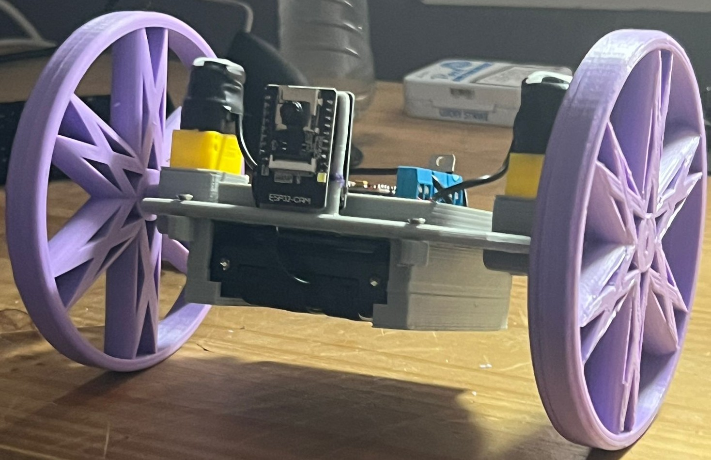
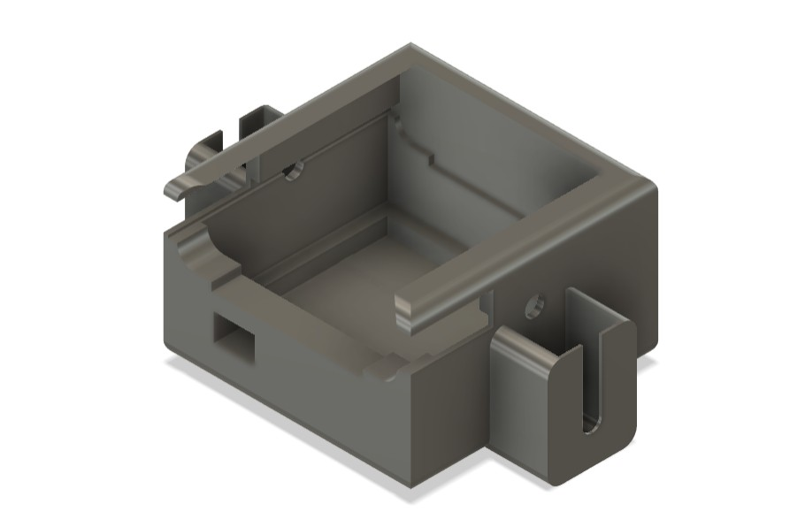
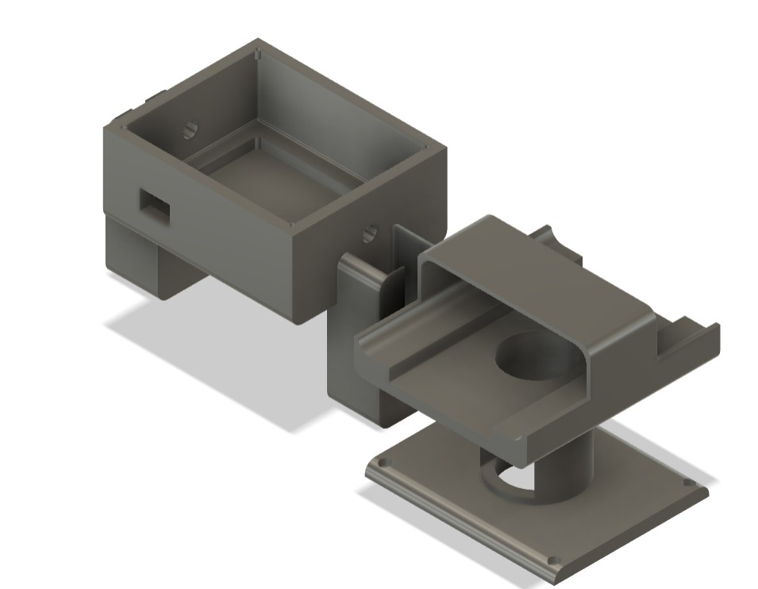
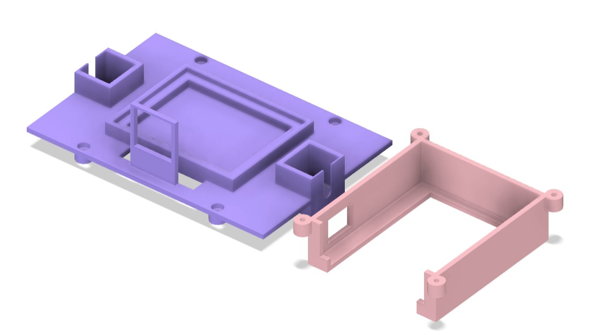
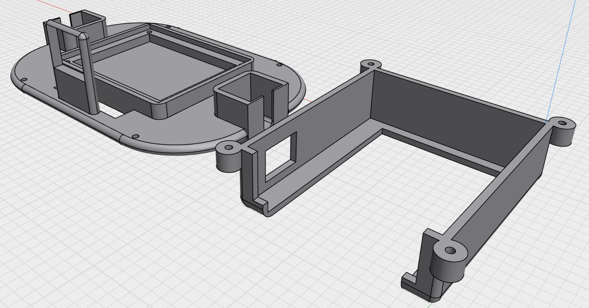
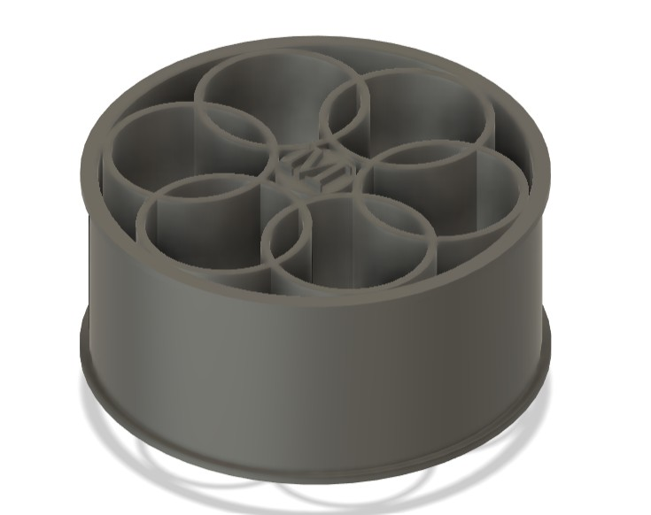
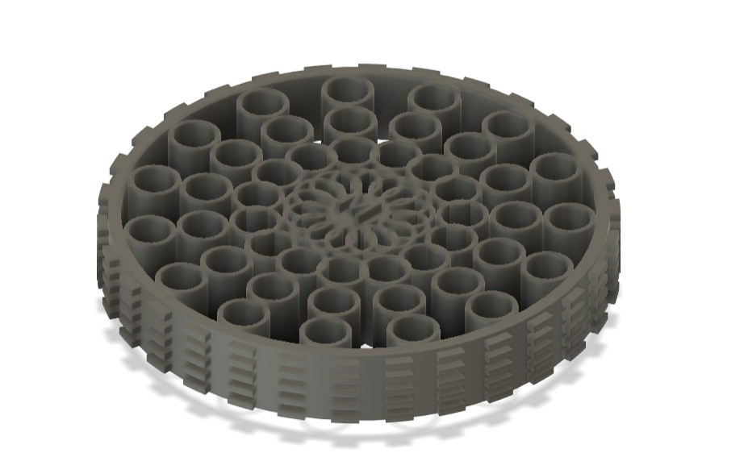
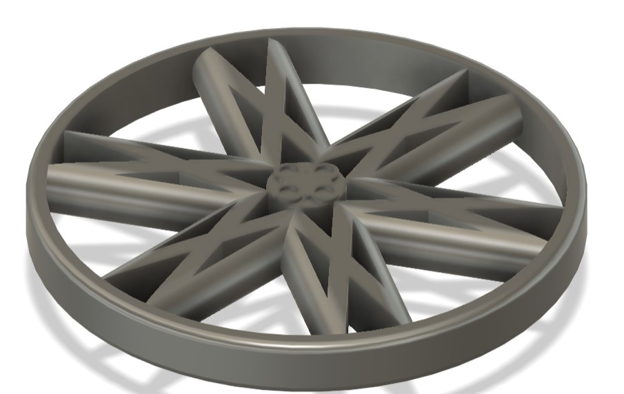
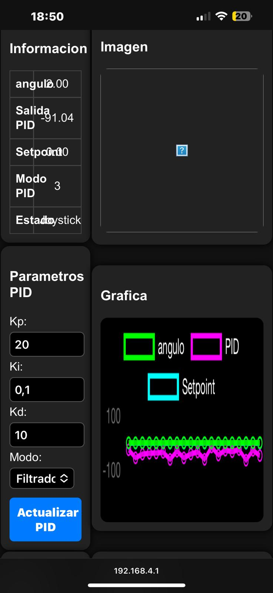
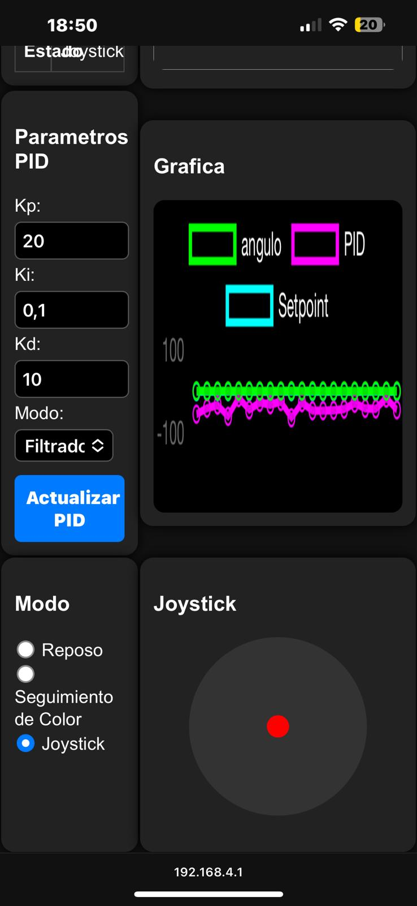

# Práctica 4 - PID en tiempo discreto y Práctica 6 - proyecto péndulo invertido



### Miguel Estévez Díaz
#### 2º Robótica - Teoría de contol


## Descripción:

Esta práctica combina el diseño de un controlador PID en tiempo discreto (Práctica 4) con su aplicación en un sistema físico real: el control de un péndulo invertido sobre un robot móvil (Práctica 6). El objetivo es lograr el equilibrio vertical del péndulo mediante una estrategia de control implementada en un microcontrolador ESP32.

---

## Metodología:

1. Diseño del hardware necesario -> Diseñar la pcb seleccionando los componentes necesarios para el correcto funcionamiento del pendulo
2. Montage del hardware -> Soldado de los componentes a la pcb.
3. Diseño del cuerpo adecuado -> Pasando por varias versiones tanto del modelo del cuerpo como de las ruedas
4. Diseño de una interfaz web de control y monitoreo del robot -> permitiendo un control "universal" puesto que el servidor va dentro del robot

---

## Objetivos:

1. Estabilidad Perpendicular al Suelo -> Garantizar que el robot sea capaz de mantenerse estable en posición perpendicular al suelo. *Logrado*
2. Compensación de Empujones -> Desarrollar la capacidad del robot para compensar empujones y evitar caídas. *Logrado*
3. Arranque desde Cualquier Posición -> Lograr que el robot pueda iniciar su funcionamiento desde cualquier posición inicial. *Logrado*
4. Implementación de un sistema de control y monitorización web. *Logrado*
5. Interconexión con el módulo de la cámara. *No logrado debido a recibir un módulo defectuoso*

---

## Controlador PID discreto

Para mantener el código limpio, reutilizable y fácil de ampliar, el controlador PID se implementó como una clase externa (`PIDcontrol.h/.cpp`). Esta estructura permite encapsular la lógica de control y utilizar diferentes variantes del algoritmo PID simplemente instanciando distintos objetos.

Se definió una **clase abstracta base `PID`**, de la cual heredan tres implementaciones concretas:

### PID_Discreto

La versión más clásica del PID discreto, basada en la fórmula de diferencias hacia atrás. Calcula el error, acumula la integral y estima la derivada con una simple resta:

```cpp
u[k] = Kp * e[k] + Ki * ∑e[k] + Kd * (e[k] - e[k-1])
```

Se utiliza como base funcional por su sencillez y claridad.

### PID_IIR

Una variante más avanzada que implementa el PID como un **filtro IIR** (respuesta infinita al impulso), utilizando los errores actuales y pasados con coeficientes precalculados (`A0`, `A1`, `A2`).

Esta versión tiene ventajas en estabilidad y respuesta cuando se ajusta correctamente, y es adecuada para sistemas embebidos donde se desea una actualización rápida sin cálculos innecesarios.

### PID_Filtrado

Incorpora una **derivada filtrada mediante un filtro pasabajo**, lo que reduce el ruido en la señal de control, especialmente útil cuando se trabaja con sensores como el MPU6050. Aplica un filtro digital en la parte derivativa del PID, lo que suaviza la salida:

```cpp
D_filtrado[k] = α₁(d₀ + d₁) - α₂ * D_filtrado[k-1]
```

Ideal para escenarios reales con señales ruidosas o derivadas inestables.

---

### Uso en el código principal

Desde el `main.ino`, se puede crear el controlador simplemente así:

```cpp
PID* pid = new PID_Filtrado(Kp, Ki, Kd, dt, N);  // o PID_Discreto o PID_IIR
float control_output = pid->compute(setpoint, measured_angle);
```

Esto permite intercambiar fácilmente el tipo de controlador sin modificar el resto del código del sistema.

---

## Modelos implementados

### Cuerpos:

Para este proyecto se diseñaron 4 versiones del cuerpo diferentes, con las cuales se realizaron diferentes pruevas.

#### Versión 1: 



Con esta versión tenía 2 problemas:
1. Las ruedas eran muy pequeñas, permitiendo muy poca inclinación antes de que el cuerpo petara contra el suelo
2. El centro de masas estava muy abajo, y el robot no era capar de compensar bien las caidas 

#### Versión 2: 



Con esta versión tenía 2 problemas:
1. Los motores son muy poco potentes, con lo cual no alcanzan la suficiente velocidad para compensar la caida
2. esta es más teória, puesto que no pude provar otros motores, el centro de gravedad esta situada 1-2cm demasiado alto.

#### Versión 3: 

Descartando hacer unha versión con el centro de gravedad alto debido a la potencia de los motores pase a diseñar uno con el centro de gravedad bajo.



Con esta versión tenía 1 problemas:
1. Las ruedas eran muy pequeñas, permitiendo muy poca inclinación antes de que el cuerpo petara contra el suelo

Cabe recalcar en si que este no fue el motivo por el que la descarte, fue si no porque cuando estava sintonizando el pid dio unha vuelta de golpe partiendo el soporte del modulo de la cámara (el módulo no sufrio ningun golpe, no estava montado en ese momento)

#### Versión 4: 

Visto lo anterior decidí hacer el soporte un poco más ancho, y de paso aproveche para darle un diseño más estético y moderno



Con esta versión tenía 1 problemas:
1. Las ruedas eran muy pequeñas, permitiendo muy poca inclinación antes de que el cuerpo petara contra el suelo, aunque ya estava solucionado puesto que ya implementara las de la segunda versión, consiguiendo que en caso de que el robot dira una vuelta completa no chocara ni el soporte de la cámara contra el suelo

### Ruedas:

Para este proyecto se diseñaron 3 versiones del cuerpo diferentes, con las cuales se realizaron diferentes pruevas.

#### Versión 1:



Están diseñadas para aprovechar los neumáticos de las ruedas que venían con los motores, es decir un cambio de yantas

En el diseño final no llevan ni al suelo al estar montadas a causa de que la powerbanck es muy ancha (algo más de 2cms)

#### Versión 2: 



Se podría decir que eran las causantes dfe que el cuerpo tuviera poco ángulo de rotación, pero realmente las cambie a causa de la rotura del soporte de la cámara

#### Versión 3: 



Versión definitiva, aunque me huviera gustado hacerla con tacos como la primera versión

---

## Servidor web:

Como en este tipo de implementaciones lo que se busca es desarrollar una interfaz intuytiva y sencilla, con lo cúal me decidí por no poner mucha cosa para usarlo desde un teléfono móvil (la referencia usada fue uno bastante grande, concretamente use de referencia un iphon 13 pro max), obteniendo el siguiente diseño completamente funcional:

<p align="center">
  
  
</p>

---

## Conclusiones:

Quitando la parte de añadirle la muestra de la imagen desde la cámara todo funciona perfectamente, autobalanceandose el robot y resistiendo a empujones como se puede ver en en siguiente video: [Ver vídeo de la demo del péndulo](https://youtube.com/shorts/DccQZT0np7g)

Cabe recalcar que a futuro tengo pensado añadirle un sensor de ultrasonidos para permitirle hacer navegaciones en base a el y a la cámara.